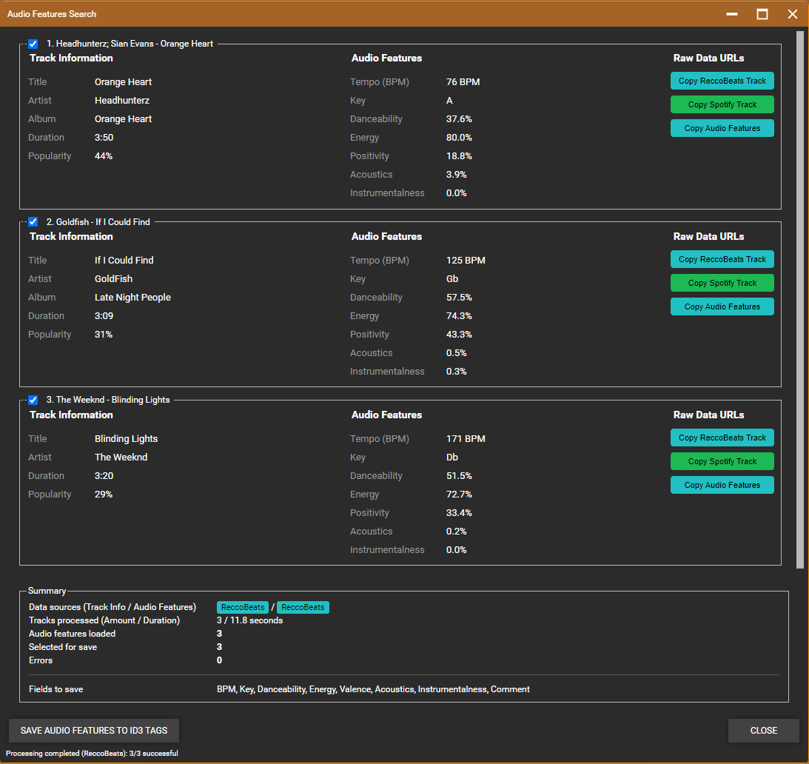
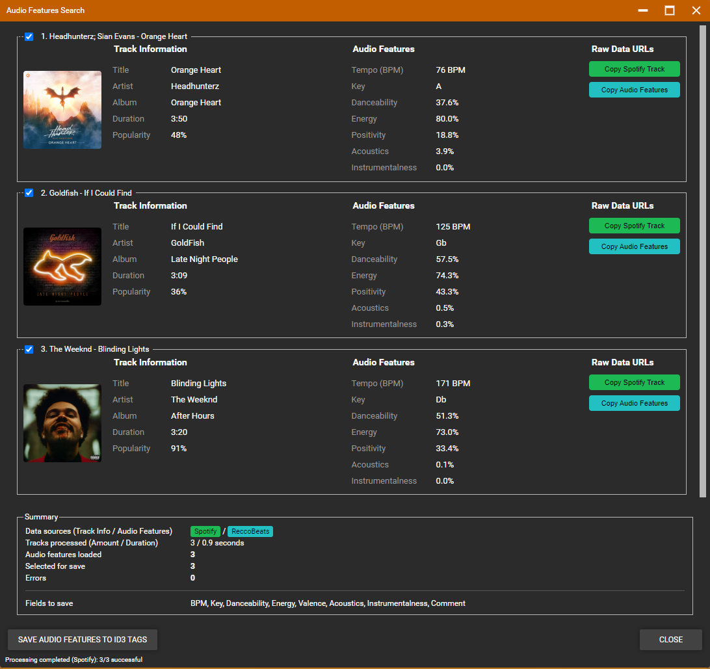

# MM Audio Features

This MediaMonkey addon enhances your music collection by automatically fetching and storing detailed audio features for your tracks. Using ReccoBeats' audio feature database with optional Spotify integration for enhanced track matching, this addon enriches your metadata with professional audio characteristics.

## ✨ Features

### 🎵 Comprehensive Audio Feature Retrieval
- **BPM (Tempo)**: Precise beats per minute for DJ mixing and workout playlists
- **Musical Key**: Track's key signature for harmonic mixing
- **Danceability**: How suitable a track is for dancing (0-100%)
- **Energy**: Intensity and power of the track (0-100%)
- **Valence**: Musical positivity/mood of the track (0-100%)
- **Acousticness**: Confidence measure of acoustic vs. electric instruments (0-100%)
- **Instrumentalness**: Likelihood that a track contains no vocals (0-100%)

### 🔧 Smart Integration
- **ReccoBeats Search**: Works out-of-the-box without credentials, but requires **precise track metadata** - Artist, Title, and Album must match official release information exactly for successful track identification
- **Optional Spotify Search**: *Recommended for better accuracy* - Enhanced track matching using Spotify's comprehensive database with fuzzy search capabilities
- **Dual Search Options**: Choose between ReccoBeats (no setup, strict matching) or Spotify (better results, intelligent matching) for track identification
- **ReccoBeats Audio Features**: All audio features are retrieved from ReccoBeats' pre-analyzed database
- **Flexible Configuration**: Choose which audio features to save and which search method to use
- **Custom Field Mapping**: Maps audio features to MediaMonkey's custom fields
- **Batch Processing**: Process multiple tracks simultaneously
- **Error Handling**: Graceful handling of tracks not found in databases

### 🎛️ User Experience
- **Intuitive Search Dialog**: User-friendly interface with real-time progress
- **Detailed Results View**: Preview all audio features before saving
- **Configurable Output**: Enable/disable specific audio features
- **Search Method Selection**: Choose between ReccoBeats and Spotify search
- **Keyboard Shortcut**: Quick access via `Ctrl+Shift+A`
- **Context Menu Integration**: Available in the "Edit Tags" menu

## 🚀 Installation

### Prerequisites
- MediaMonkey 5.x
- Active internet connection
- *Optional*: Spotify Developer Account (for enhanced performance & search accuracy)

### Setup Steps

1. **Install the Addon**
   - Download the latest `.mmip` file from [releases](https://github.com/DrHardReset/MMAudioFeatures/releases/latest)
   - Double-click to install in MediaMonkey

2. **Basic Configuration**
   - Go to **Tools > Options > General > Add-ons**
   - Find "MM Audio Features" and click **Configure**
   - Select "ReccoBeats Search" for immediate use
   - Select which audio features to save

3. **Optional: Enhanced Spotify Search Setup**
   - ⚠️ As of January 2026, Spotify "temporarily" disabled creation of new apps, see [Spotify community discussion](https://community.spotify.com/t5/Spotify-for-Developers/Unable-to-create-app/td-p/7283365)
   - Visit [Spotify Developer Dashboard](https://developer.spotify.com/dashboard/)
   - Create a new app
   - Use any **App name** and **App description** of your choice
   - Set **Redirect URL** to `https://developer.spotify.com` (or any valid URL)
   - Select checkbox to use `Web API`
   - Note your `Client ID` and `Client Secret`
   - In addon configuration, select "Spotify Search" and enter your credentials

## 📖 Usage

### Search Methods
The addon offers two search methods for track identification:

**ReccoBeats Search** (Default)
- ✅ Works immediately without setup
- ✅ No API credentials required
- ❗ slow and quite limited track matching results

**Spotify Search** (*Recommended*)
- ⭐ Enhanced accuracy and performance
- ⭐ Superior track matching capabilities
- ⚙️ Requires free Spotify Developer account
- ⚙️ API credentials setup needed

### How It Works
1. **Track Identification**: The addon searches for tracks using your selected method (ReccoBeats or Spotify)
2. **Feature Retrieval**: Audio features are retrieved from ReccoBeats' comprehensive database
3. **Data Mapping**: Audio features are stored in your MediaMonkey database according to your configuration

### Basic Usage
1. Select tracks in your MediaMonkey library
2. Right-click and choose **Edit Tags > Search Audio Features**
3. Or use keyboard shortcut `Ctrl+Shift+A`
4. Review the found audio features in the dialog
5. Click **Save** to apply the changes to your tracks

*ReccoBeats search: Track matching with audio features and direct API access*

*Spotify search: Enhanced track matching with album covers, track details and ReccoBeats audio features*

### Configuration Options

| Setting | Description | Default |
|---------|-------------|---------|
| **Search Method** | ReccoBeats or Spotify search | ReccoBeats |
| **Spotify Client ID** | Your Spotify app client ID | *Optional* |
| **Spotify Client Secret** | Your Spotify app secret | *Optional* |
| **Save BPM** | Store tempo as BPM field | ✅ Enabled |
| **Save Initial Key** | Store musical key | ✅ Enabled |
| **Save Danceability** | Store as Custom1 field | ✅ Enabled |
| **Save Energy** | Store as Custom2 field | ✅ Enabled |
| **Save Valence** | Store as Custom3 field | ✅ Enabled |
| **Save Acousticness** | Store as Custom4 field | ✅ Enabled |
| **Save Instrumentalness** | Store as Custom5 field | ✅ Enabled |
| **Save Comment** | Add field mapping to comment | ✅ Enabled |

### Field Mapping

The addon maps audio features to MediaMonkey fields as follows:

- **BPM** → `Track.BPM`
- **Key** → `Track.InitialKey`
- **Danceability** → `Track.Custom1`
- **Energy** → `Track.Custom2`
- **Valence** → `Track.Custom3`
- **Acousticness** → `Track.Custom4`
- **Instrumentalness** → `Track.Custom5`

When enabled, the comment field includes a mapping reference:
##############################\
AudioFeatures:\
• Custom1: Danceability\
• Custom2: Energy\
• Custom3: Valence\
• Custom4: Acousticness\
• Custom5: Instrumentalness\
##############################

## ⚖️ Legal Disclaimer & Third-Party Services

### API Usage & Terms of Service
This addon uses third-party APIs to retrieve audio feature data:

- **ReccoBeats API**: Primary service for audio features and track search
  - No registration required for basic functionality
  - Audio features are retrieved according to ReccoBeats' usage policies

- **Spotify Web API**: Optional enhanced track identification
  - Users may obtain their own Spotify Developer credentials for improved accuracy
  - All Spotify API usage is subject to [Spotify's Terms of Service](https://developer.spotify.com/terms/)
  - Rate limiting and usage policies apply as defined by Spotify

### Intellectual Property Notice
- **Spotify® is a registered trademark** of Spotify AB
- **MediaMonkey® is a registered trademark** of Ventis Media Inc.
- **ReccoBeats** is a service provided by ReccoBeats and subject to their terms

This addon is **independently developed** and is **not affiliated with, endorsed by, or sponsored by** Spotify AB, Ventis Media Inc., or ReccoBeats. All trademarks and service marks are the property of their respective owners.

### Data & Privacy
- This addon does **not store or transmit** your personal music data beyond API requests
- API calls are made directly from your MediaMonkey installation to the respective services
- No user data is collected, stored, or shared by this addon
- Audio features retrieved are stored locally in your MediaMonkey database only

### Limitation of Liability
This software is provided "AS IS" without warranty of any kind. The author assumes no responsibility for:
- API service availability or accuracy
- Data loss or corruption
- Violation of third-party terms of service
- Any damages arising from the use of this software

**Users are responsible for:**
- Complying with all applicable terms of service for third-party APIs
- Obtaining proper API credentials and permissions (if using Spotify search)
- Using the addon in accordance with applicable laws and regulations

## 🏗️ Development

### Building from Source
- Debug build: copies addon data to portable MediaMonkey Scripts folder
	(C:\MediaMonkey\Portable\Scripts\MMAudioFeatures)
- Release build: creates .mmip package in bin folder

### Running Tests
- Unit-Tests: `npm test`
- Integration-Tests `npm run test:integration`

### Debugging
- Start Mediamonkey
- Open webbrowser and go to `http://localhost:9222/`

## 🤝 Contributing

1. Fork the repository
2. Create a feature branch (`git checkout -b feature/amazing-feature`)
3. Commit your changes (`git commit -m 'Add amazing feature'`)
4. Push to the branch (`git push origin feature/amazing-feature`)
5. Open a Pull Request

## 📝 License

This project is licensed under the MIT License - see the [LICENSE](LICENSE) file for details.

## 🙏 Acknowledgments

- **ReccoBeats** for providing comprehensive audio feature databases and track search capabilities
- **Spotify** for their Web API that enables enhanced track matching accuracy
- **MediaMonkey** community for support and feedback

---

**Made with ❤️ by [DrHardReset](https://github.com/DrHardReset)**

*Developed with AI assistance - This is an independent project and is not affiliated with Spotify, MediaMonkey, or ReccoBeats.*